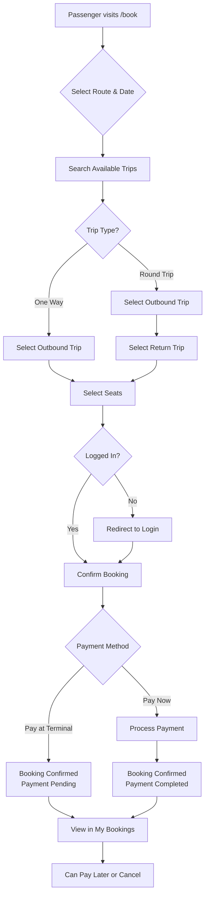
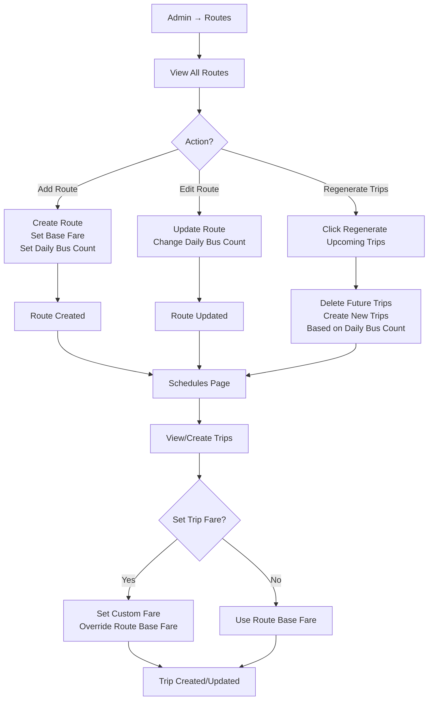
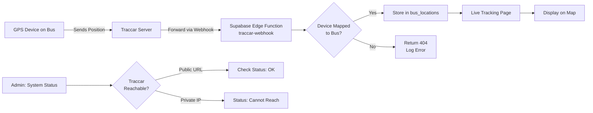
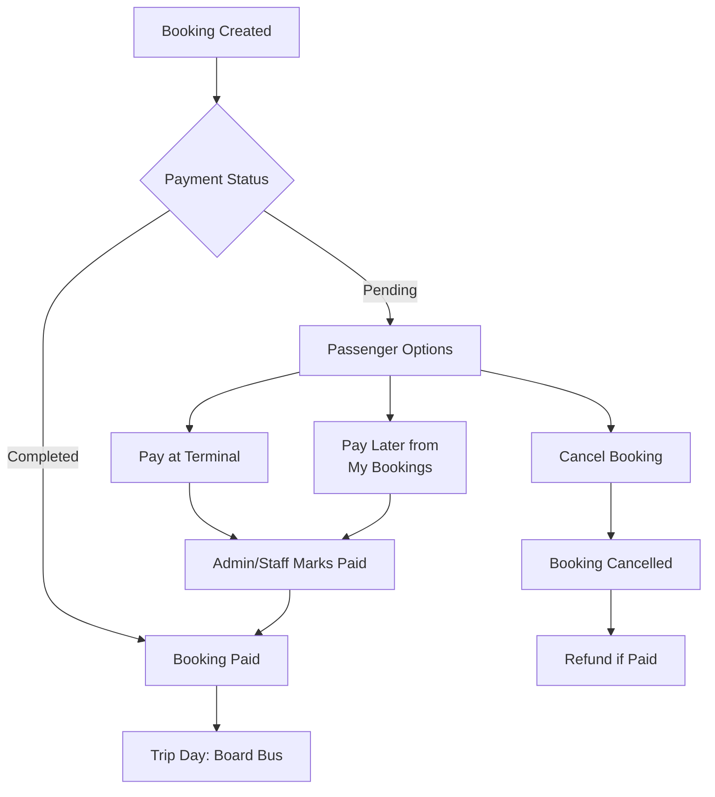
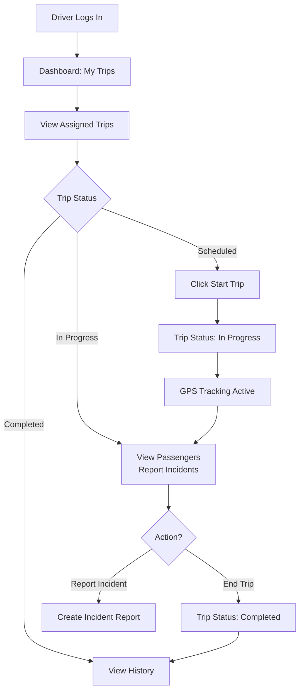
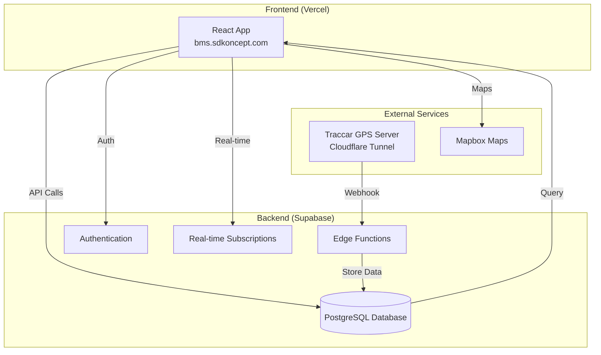
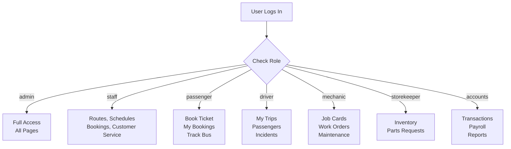
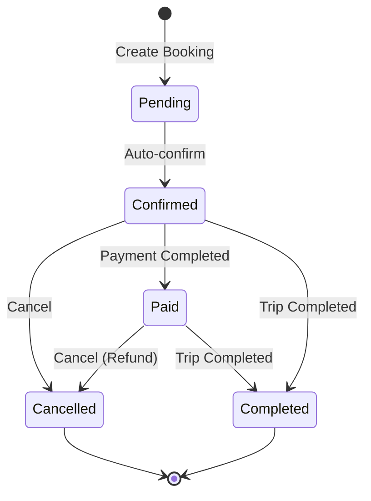

# FleetMaster Bus Management - Flow Diagrams

This document contains visual flow diagrams for key user journeys and system processes.

## Table of Contents

1. [Passenger Booking Flow](#passenger-booking-flow)
2. [Admin Route & Trip Management](#admin-route--trip-management)
3. [GPS Tracking Flow](#gps-tracking-flow)
4. [Payment Flow](#payment-flow)
5. [Driver Trip Management](#driver-trip-management)
6. [System Architecture](#system-architecture)

---

## Passenger Booking Flow

---

## Admin Route & Trip Management

---

## GPS Tracking Flow

---

## Payment Flow

---

## Driver Trip Management

---

## System Architecture

---

## User Role Access Flow

---

## Booking Status Lifecycle

---

*Last updated: February 2026*
